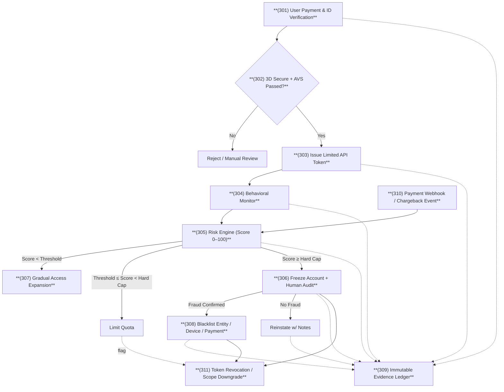

# FIG.3 – Audit & Revocation Flow (LORI Safeguard)

## Figure Description
FIG.3 顯示 LORI Safeguard 的「稽核與撤權流程」：使用者先通過 3DS/AVS（302），取得限額 Token（303），之後行為被持續監控（304），並由風險引擎（305）計算風險分數，若超過門檻則進行凍結與人工審核（306），如確認詐欺則黑名單處理（308），所有操作記錄於不可竄改帳本（309），若有退款/爭議則回饋至風險引擎（310），Token 可撤銷或降權（311）。

## Reference Numerals
- **(301)** Payment & ID Verification  
- **(302)** 3D Secure + AVS Gate  
- **(303)** Issue Limited API Token  
- **(304)** Behavioral Monitor  
- **(305)** Risk Engine (Score 0–100)  
- **(306)** Freeze Account + Human Audit  
- **(307)** Gradual Access Expansion  
- **(308)** Blacklist (Entity/Device/Payment)  
- **(309)** Immutable Evidence Ledger  
- **(310)** Payment Webhook / Chargeback Event  
- **(311)** Token Revocation / Scope Downgrade

## Notes for USPTO
- 建議以**黑白線條**輸出本圖（SVG 或 PDF），保留編號與粗體節點名。  
- 在說明書中以「FIG.3」引用本圖，並在文字中對應上述 Reference Numerals。  
- 可在 `docs/IP_Execution_Record.md` 的 §6「Immutable Audit and Revocation Flow」段落連結本圖。
----

> Reference Numerals: (301) Payment & ID, (302) 3DS/AVS Gate, (303) Limited Token, (304) Behavioral Monitor, (305) Risk Engine, (306) Freeze & Human Audit, (307) Access Expansion, (308) Blacklist, (309) Immutable Ledger, (310) Payment Webhook/Chargeback, (311) Token Revocation/Scope Downgrade

----

<text x="50%" y="98%" text-anchor="middle"
      font-size="12" font-family="Arial" fill="rgba(80,80,80,0.4)">
  LORI FRAMEWORK © 2025 – ETHICAL SYSTEM ORIGINAL WATERMARK
</text>
